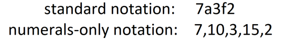
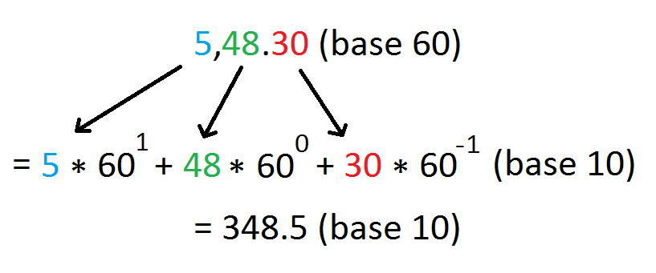

# Radix-Converter

Converts a number from one radix (base) to another.

## Features:
- supports all bases 1 and above (up to a very high, but unknown base)
- supports fractional numbers
- allows the user to choose the symbol that represents each value
- supports numbers of mixed bases (each digit of a number can be in a different base)
- supports both standard form and [numerals-only form](https://github.com/wheelercj/Radix-Converter/tree/master#what-is-numerals-only-form)
- a simple interface: just enter the starting base, target base, and starting number
- precise approximations when necessary, with adjustable precision

Information on the various bases and how each one can be helpful:  
https://en.wikipedia.org/wiki/List_of_numeral_systems#Standard_positional_numeral_systems

## What is numerals-only form?
Numerals-only form is a system for representing numbers of any base using only numerals (0-9), as opposed to also using letters such as for hexadecimal (base 16), which normally uses A for 10, B for 11, etc. up to F for 15.

To write a number in numerals-only form, simply write commas between each of the digits, then replace digits that are not numerals with their numeral value. For example, the hexadecimal number 7A3F2 in standard form can be written as 7,10,3,15,2 in numerals-only form.

Unlike standard form, numerals-only form is not limited by the number of symbols that can be typed.

As another example, let's say you want to convert 5 hours, 48 minutes, and 30 seconds into minutes. With this program, you can select base 60 as the starting base, base 10 as the target base, and 5,48.30 as the starting number. The program then considers 5, 48, and 30 each as individual digits in the conversion calculation:

## Tips:
- Unary (base 1) allows any digit to be used in the starting number
- to enter a numerals-only number of a base that can be represented in standard form, but is too short to include commas, enter an extra comma at the end or beginning of the number (the program detects numerals-only form if the starting base is too high for standard form, or if there is at least one comma).
