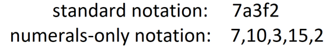
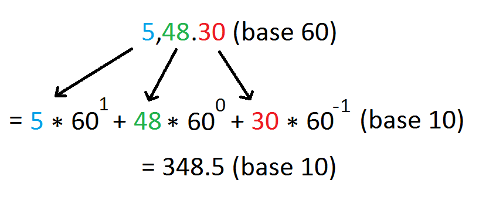

# Radix-Converter
Convert a number from one radix (base) to another.

## Features:
- support for bases 1 to 36 in standard notation
- support for bases 1 and above in [numerals-only notation](https://github.com/wheelercj/Radix-Converter/blob/master/README.md#what-is-numerals-only-notation) (up to an unknown, but very high base)
- support for fractional numbers
- a simple interface: just enter the starting base, target base, and starting number
- accurate approximations when necessary, labelled "approx"

## What is numerals-only notation?
Numerals-only notation is a system for representing numbers of any base using only numerals (0-9), as opposed to also using letters such as for hexadecimal (base 16), which normally uses A for 10, B for 11, etc. up to F for 15.

To write a number in numerals-only notation, simply write commas between each of the digits, then replace digits that are not numerals with their numeral value. For example, the hexadecimal number 7A3F2 in standard notation can be written as 7,10,3,15,2 in numerals-only notation.

Unlike standard notation, numerals-only notation is not limited by the number of symbols that can be typed.

As another example, let's say you want to convert 5 hours, 48 minutes, and 30 seconds into minutes. You can select base 60 as the starting base, base 10 as the target base, and enter 5,48.30 as the starting number. The program then considers 5, 48, and 30 each as individual digits in the conversion calculation:

## Tips:
- Unary (base 1) allows all numerals and letters to be used in the starting number
- to enter a numerals-only number of a base that can be represented in standard form, but is too short to include commas, insert a zero and a comma in front of the number (the program detects numerals-only form if the starting base is too high for standard form, or if there is at least one comma)
